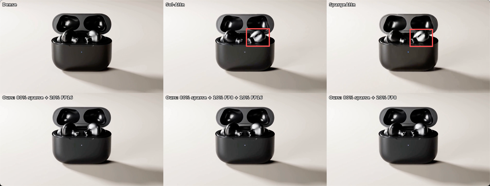
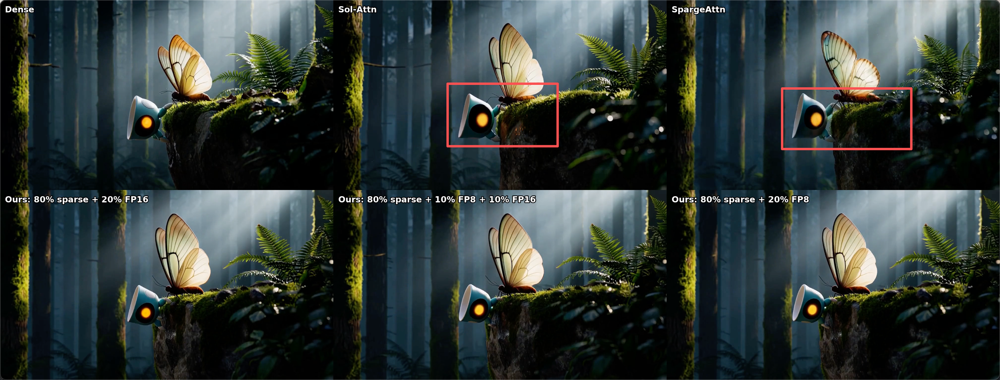
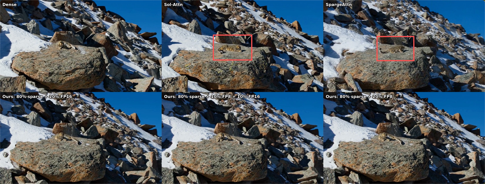
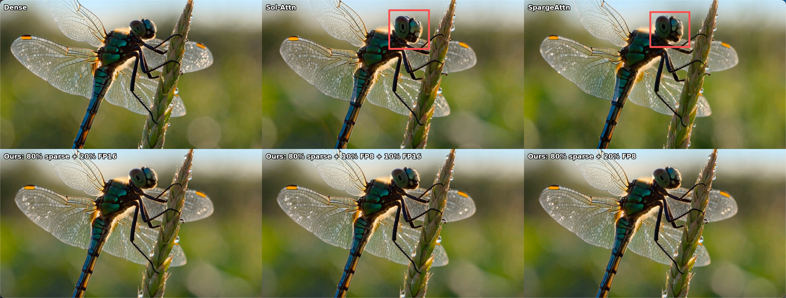
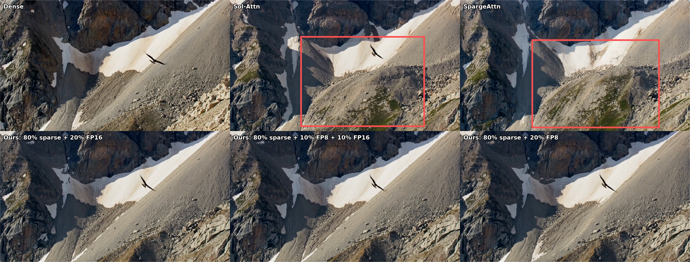
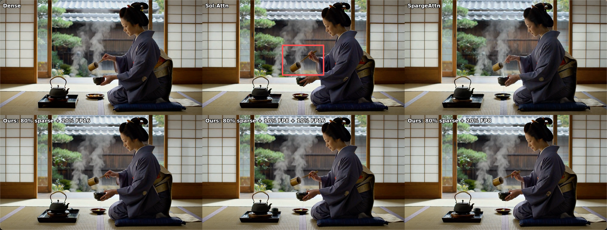
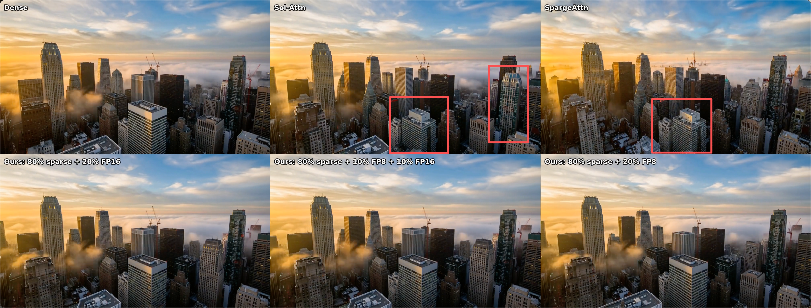
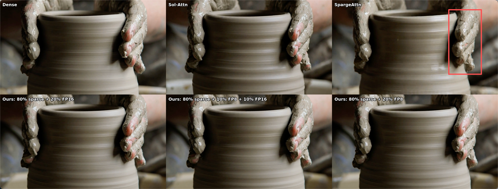

# Anemoi Project

Anemoi is an inference-only, training-free framework for high-performance visual generation, with a special focus on video generation.
Unlike existing approaches that operate primarily on flattened 1D token sequences for attention design, Anemoi reasons over spatially structured 2D visual regions ([Draft Attention](https://arxiv.org/pdf/2505.14708)) to identify redundancy and adaptively route attention computation.

Currently, Anemoi supports stripe-compact ragged 2-D routing and native
Mixed-Precision Attention (MPA) on SM89 and SM120. The executable model family
is MiniMax-H3 on RTX 4090 and RTX 5090 GPUs.

## Installation

Linux, an NVIDIA GPU, and a CUDA toolkit containing `nvcc` are required for the native MiniMax-H3 MPA path. We recommend Conda for environment management. The setup script creates (or updates) an environment named `anemoi`, installs the pinned MiniMax-H3 runtime dependencies, Anemoi itself, and the development tools:

```bash
scripts/setup_conda_env.sh
conda activate anemoi
```

It detects the lowest NVIDIA driver version across the visible GPUs and picks a matching CUDA/PyTorch stack. Preview the selection without changing the environment with `scripts/setup_conda_env.sh --dry-run`.

The script installs Python 3.12 and does not compile the CUDA extensions during installation. The MiniMax-H3 launcher builds them for the active PyTorch and CUDA installation when the MPA candidate is selected.

For framework-only development, run the checks after activating the environment:

```bash
python -m unittest discover -s tests
```

## MiniMax-H3 Quick Start

After activating the `anemoi` environment, the launcher downloads only the required model components and compressed DiT, builds the native MPA extensions, selects a valid number of visible GPUs, and generates the demo video:

```bash
scripts/run_minimax_h3.sh
```

By default, resources are stored under the ignored
`models/minimax-h3/` directory and output is written to
`outputs/minimax-h3/mpa-ragged2d-mixed/out.mp4`.

Requirements:

- Linux and CUDA with `nvcc`
- one or more NVIDIA GPUs
- Conda (recommended), or Python 3.12 with `venv` support
- network access to GitHub and Hugging Face on the first run

The native MPA candidate requires a homogeneous set of SM89 GPUs such as RTX
4090 or SM120 GPUs such as RTX 5090. The launcher is not fixed to four GPUs: it
automatically chooses the largest supported Ulysses degree from the visible
devices. On one or two GPUs with less than 32 GiB each, it also selects the
832x480 demo profile to avoid running out of memory; four 24 GiB GPUs keep the
validated 1344x768 profile. Explicit `--height` and `--width` values override
this choice. Override the process count when needed:

```bash
ANEMOI_NUM_GPUS=2 scripts/run_minimax_h3.sh
```

MiniMax-H3 has 56 attention heads, so the selected GPU count must divide 56. Memory headroom and performance still depend on the selected hardware.

Use the same runner for the controlled attention references:

```bash
scripts/run_minimax_h3.sh dense outputs/minimax-h3/dense
scripts/run_minimax_h3.sh official-sol outputs/minimax-h3/official-sol
scripts/run_minimax_h3.sh mpa-ragged2d-mixed outputs/minimax-h3/mpa
```

Dense is the quality baseline; the state-of-the-art method [Sol-Attn](https://github.com/NVlabs/Sana/tree/sol-engine) is introduced as a reference implementation. All three paths use the same checkpoint, conditioning, model fusions, Ulysses degree, seed, scheduler, and decoder.

The launcher selects the production policy for the detected GPU architecture:

- SM89 uses Q64 FP8/FP16 from
  [`examples/minimax-h3/mpa-ragged2d-mixed.yaml`](examples/minimax-h3/mpa-ragged2d-mixed.yaml);
- SM120 uses Q64 pure INT8, including INT8 prefix-query attention, from
  [`examples/minimax-h3/mpa-sm120-q64-int8.yaml`](examples/minimax-h3/mpa-sm120-q64-int8.yaml).

Both defaults enable same-frame adjacency anchors. Missing anchors replace the
weakest retained edge in the lowest active precision, so they consume the
fixed route budget instead of expanding it. Pass `--mpa-config` only to select
an explicit or edited configuration:

```bash
scripts/run_minimax_h3.sh \
  mpa-ragged2d-mixed \
  outputs/minimax-h3/mpa \
  --mpa-config examples/minimax-h3/mpa-ragged2d-mixed.yaml
```

For example, the SM120 default can be stated explicitly as:

```bash
scripts/run_minimax_h3.sh \
  mpa-ragged2d-mixed \
  outputs/minimax-h3/mpa-sm120-q64 \
  --mpa-config examples/minimax-h3/mpa-sm120-q64-int8.yaml
```

The configuration controls query geometry, sparsity, precision phases,
optional route corrections, and the dense-first schedule without requiring
Python source changes.

See [the reproduction guide](anemoi/models/minimax_h3/REPRODUCTION.md) for pinned resource revisions, manual setup, smoke tests, output contracts, and resource overrides.

## Visualization Examples

Each video is generated at 1344×768 resolution, with 239 frames at 24 FPS. Latency is tested on 4x4090 GPUs. **Only attention acceleration methods** are adopted during video generation. The five panels are ordered from left to right as
follows:

| Baseline | Sol-Attn | SpargeAttn | Anemoi | Anemoi | Anemoi |
|:---:|:---:|:---:|:---:|:---:|:---:|
| Dense | ~78% sparsity | 80% sparsity + 20% FP8 | 80% sparsity | 80% sparsity + 10% FP8 | 80% sparsity + 20% FP8 |
| 425.52s | 355.02s (1.20x) | 347.24s (1.23x) | 336.77s (1.26x) | 333.51s (1.28x) | 328.26s (1.30x) |

**Minimalist Product Advertisement**



[Full-resolution MP4](asserts/visualization/videos/01_极简产品广告_compare6.mp4)

**3D Animated Short**



[Full-resolution MP4](asserts/visualization/videos/03_3D动画短片_compare6.mp4)

**Nature Documentary**



[Full-resolution MP4](asserts/visualization/videos/05_自然纪录片_compare6.mp4)

**Macro Insect**



[Full-resolution MP4](asserts/visualization/videos/09_微距昆虫_compare6.mp4)

**Eagle in Flight**



[Full-resolution MP4](asserts/visualization/videos/15_鹰击长空_compare6.mp4)

**Tea Ceremony**



[Full-resolution MP4](asserts/visualization/videos/18_茶道_compare6.mp4)

**City Time-Lapse**



[Full-resolution MP4](asserts/visualization/videos/30_城市延时_compare6.mp4)

**Pottery Wheel**



[Full-resolution MP4](asserts/visualization/videos/37_陶轮_compare6.mp4)

More videos are available in [`asserts/visualization/videos/`](asserts/visualization/videos/).

## Repository Layout

- `anemoi/models/minimax_h3/`: model adapter, runner, resource downloader, and
  package-local Sol runtime
- `anemoi/layers/attention/mpa/`: reusable MPA routing and SM89/SM120 backends
- `csrc/`: native mixed-attention CUDA sources
- `scripts/run_minimax_h3.sh`: download-to-video entry point
- `scripts/build_*_cuda.sh`: standalone native-extension builds

The remaining model registry and generic Draft Attention implementation are kept as framework infrastructure; MiniMax-H3 is the current validated end-to-end path.

## Organization
- Zhejiang University
- Nanjing University

## Acknowledgement
Currently, this repo is mainly contributed by [Rui Ding](https://openreview.net/profile?id=~Rui_Ding15) and [Weize Ma](https://openreview.net/profile?id=~Weize_Ma1) from Nanjing University. The Draft Attention design comes from [Xuan Shen](https://shawnricecake.github.io/) from Zhejiang University.
